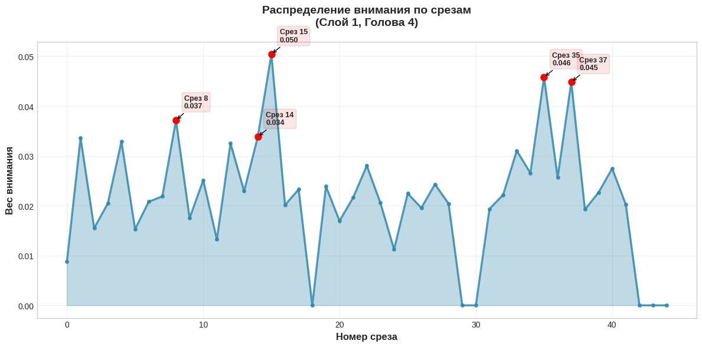
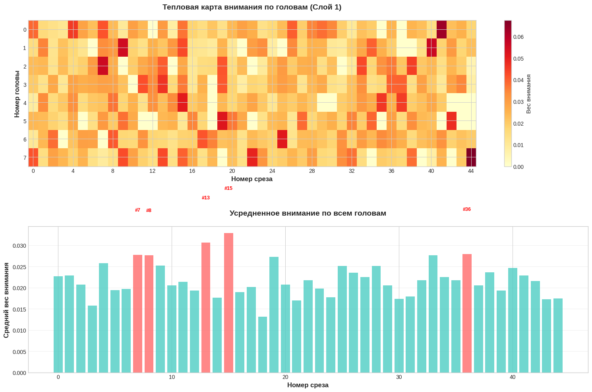
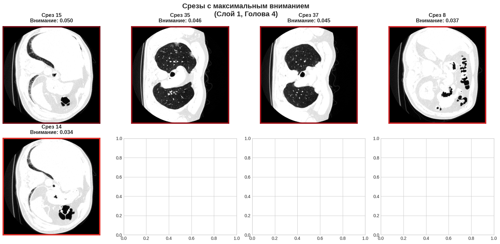

# Классификация КТ-снимков легких: 2D и 3D подходы

Проект по автоматической классификации КТ ОГК с использованием глубокого обучения. Реализованы два подхода: классификация отдельных 2D-срезов и анализ полных 3D-сканов с механизмом внимания.

## Архитектура моделей

### CTClassifier (2D)
- **Основа**: EfficientNet-B0 с дообучением
- **Вход**: отдельные КТ-срезы 384×384px
- **Задача**: бинарная классификация "норма/патология"

### SliceFormer3D (3D) 
- **Энкодер**: предобученный CTClassifier
- **Архитектура**: трансформер + механизм внимания
- **Вход**: последовательности до 256 срезов
- **Особенность**: выявление важных для диагностики срезов

## Данные

**Источники данных:**
- MosMedData (COVID-19 + нормальные случаи)
- IQ-OTHNCCD Lung Cancer Dataset
- Large COVID-19 CT Slice Dataset

**Поддерживаемые форматы:**
- DICOM (.dcm) - серии срезов
- NIfTI (.nii, .nii.gz) - 3D объемы
- Изображения (.jpg, .png) - отдельные срезы


### 1. Установка зависимостей
```bash
pip install torch torchvision nibabel pydicom scikit-learn matplotlib seaborn
```

### 2. Обучение 2D классификатора
```python
from models import CTClassifier
from train import train_model

model = CTClassifier(embed_dim=128).to(device)
history = train_model(
    model, train_loader, val_loader, device,
    epochs=10, lr=1e-4, save_path='best_2d_model.pth'
)
```

### 3. Обучение 3D классификатора
```python
from models import SliceFormer3D
from train import setup_fine_tuning_complete, create_complete_optimizer

scan_model = SliceFormer3D(slice_encoder=pretrained_encoder)
pre_history = train_model(scan_model, train_loader, val_loader, device, epochs=4)

setup_fine_tuning_complete(scan_model, backbone_unfreeze_layers=3)
optimizer = create_complete_optimizer(scan_model)
post_history = train_model(scan_model, train_loader, val_loader, device, epochs=8)
```

### 4. Метрики качества
| Модель | F1-score | Precision | Recall | ROC-AUC |
|--------|----------|-----------|--------|---------|
| CTClassifier (2D) | 0.99 | 0.99 | 0.98 | 0.99 |
| SliceFormer3D (3D) | 0.82 | 0.84 | 0.8 | 0.77 |

### 5. Визуализация результатов


*Распределение весов внимания по срезам - видно какие срезы важны для классификации*

 
*Тепловая карта внимания по всем головам и слоям*


*Срезы с максимальным вниманием - модель фокусируется на патологических областях*
